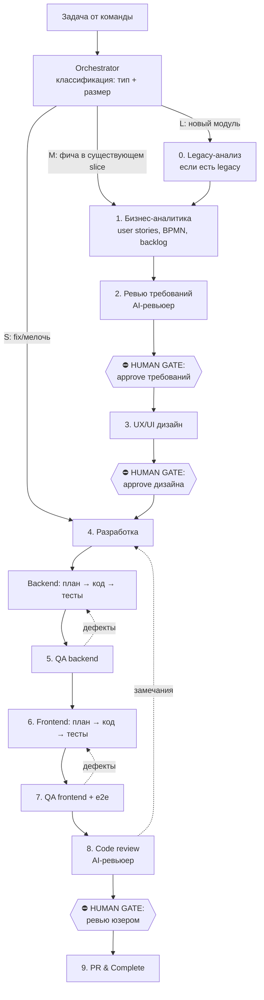

# AI Workflow — архитектура

Контекст проекта — стек, команды сборки, наличие legacy-источника — описан
в `AGENTS.md` в корне репозитория. Здесь описан сам процесс: он одинаков для
любого стека.

Этот документ — **единственный источник правды** о том, как AI-агенты работают
над проектом. Он tool-agnostic: его читают Claude Code, Codex и любой другой
агент. Файлы в `.claude/`, `.agents/` и `.codex/` — vendor-адаптеры; общая
оркестрация лежит в [feature.md](feature.md), логика этапов — в `stages/`.

## Общая схема



## Ключевые принципы

1. **Файлы — интерфейс между этапами.** Каждый этап читает артефакты
   предыдущего и пишет свои в `docs/features/<id>/`. Агент любого вендора
   может подхватить работу с любого этапа — состояние не живёт в контексте
   чата, оно живёт в файлах.
2. **Human gates обязательны и дёшевы.** AI готовит артефакт и краткое
   summary с открытыми вопросами; человек отвечает approve / список правок
   прямо в файле `status.md`. Три гейта: требования, дизайн, финальное ревью.
3. **Backend раньше frontend.** Контракт API (endpoints + DTO) фиксируется на
   этапе backend-разработки в `api-contract.md` — frontend разрабатывается
   против него, а до готовности backend может работать на моках.
4. **Один этап — один контекст.** Не тащим весь пайплайн через одну сессию:
   каждый этап запускается свежей сессией/субагентом, который читает только
   нужные ему файлы. Это защищает от деградации контекста и позволяет
   параллелить.
5. **Legacy — источник требований, а не кода.** Если проект замещает
   существующую систему (legacy-источник объявлен в `AGENTS.md`), из неё
   извлекаются бизнес-правила, схема данных и сценарии; архитектура и код не
   копируются. Без legacy-источника этап 0 не существует.

## Этапы (маппинг на 10 шагов)

| # | Этап | Файл процесса | Исполнитель | Выход (в `docs/features/<id>/`) |
|---|------|---------------|-------------|--------------------------------|
| 0 | Legacy-анализ | [stages/00-legacy-analysis.md](stages/00-legacy-analysis.md) | legacy-analyst | `legacy-analysis.md` |
| 1 | Бизнес-аналитика | [stages/01-business-analysis.md](stages/01-business-analysis.md) | business-analyst | `spec.md` (stories, BPMN, критерии) |
| 2 | Ревью требований | [stages/02-requirements-review.md](stages/02-requirements-review.md) | requirements-reviewer | замечания в `spec.md`, вердикт в `status.md` |
| — | **Gate 1** | — | **человек** | approve в `status.md` |
| 3 | UX/UI дизайн | [stages/03-ux-design.md](stages/03-ux-design.md) | ux-designer | `design.md` (+ прототип) |
| — | **Gate 2** | — | **человек** | approve в `status.md` |
| 4–5 | Backend: dev + QA | [stages/04-backend.md](stages/04-backend.md) | backend-developer, qa-engineer | код, тесты, `api-contract.md`, `qa.md` (Backend) |
| 6–7 | Frontend: dev + QA | [stages/05-frontend.md](stages/05-frontend.md) | frontend-developer, qa-engineer | код, тесты, `qa.md` (Frontend) |
| 8 | Code review | [stages/06-review-complete.md](stages/06-review-complete.md) | code-reviewer | замечания → исправления |
| — | **Gate 3** | — | **человек** | approve в `status.md` |
| 9–10 | PR & Complete | [stages/06-review-complete.md](stages/06-review-complete.md) | orchestrator | PR, обновлённый backlog |

Для S-задач (bugfix/tech-мелочь) действует сокращённый маршрут —
[stages/s-route.md](stages/s-route.md): без этапов 0–3, план в `status.md`,
один human gate.

Для F-задач (опечатка, комментарий, форматирование) — ещё короче:
[stages/f-route.md](stages/f-route.md). F отличается от S тем, что в нём нет
отдельных QA- и review-сессий: проверка сводится к одной детерминированной
команде, а ревью — к тому, что человек видит полный diff на финальном гейте.
Допустимые случаи перечислены закрытым списком; всё остальное — `S`.

## Оркестрация

**Orchestrator — это основная сессия агента** (Claude Code / Codex), а не
отдельный сервис. Его обязанности:

1. Классифицировать задачу (см. [routing.md](routing.md)) — тип, размер,
   стартовый этап.
2. Завести/обновить рабочую папку фичи `docs/features/<id>/` и `status.md`.
3. Запускать этапы через общий [feature-контракт](feature.md): в Claude Code —
   командой `/feature` и агентами `.claude/agents/`, в Codex — skill
   `$feature` и профилями `.codex/agents/`.
4. Останавливаться на human gates и явно спрашивать человека.
5. После complete — обновить `docs/backlog.md`.

## Vendor-адаптеры

| Среда | Вход | Роли |
|-------|------|------|
| Claude Code | `.claude/commands/feature.md` → `/feature` | `.claude/agents/*.md` |
| Codex | `.agents/skills/feature/SKILL.md` → `$feature` | `.codex/agents/*.toml` |

Оба входа обязаны ссылаться на [feature.md](feature.md), а не копировать
его: изменение общего маршрута делается один раз в `feature.md` и сразу
действует для всех вендоров. Таблица выше описывает полный набор адаптеров;
в проекте присутствуют те, что установлены соответствующими модулями
usai-workflow.

POSIX entrypoints остаются источником поведения скриптов. В PowerShell те же
команды запускаются через Git for Windows Bash без копирования логики:

```powershell
./scripts/new-task.ps1 <prefix> <slug> "<summary>" [F|S|M|L] [epic]
./scripts/backlog.ps1 --ids
./scripts/verify.ps1 --list
```

## Состояние фичи: `docs/features/<id>/status.md`

Машина состояний пайплайна. Каждый этап при завершении дописывает свою строку;
человек ставит approve на гейтах. Формат — см. [../features/README.md](../features/README.md).

## Роутинг

Правила выбора маршрута (какие этапы пропускать) и модели (какая модель на
каком этапе) — в [routing.md](routing.md).

## Конвенции кода

- Backend: `docs/conventions/backend.md` — правила проекта (файл приносит
  соответствующий stack-модуль или пишется руками).
- Frontend: `docs/conventions/frontend.md` — аналогично.
- Архитектурные решения фиксируются как ADR в [../adr/](../adr/README.md):
  когда писать, статусы и процесс принятия — в README каталога. Принимает
  ADR только человек (на ближайшем гейте или явно в чате).

Агенты-разработчики обязаны прочитать соответствующий файл конвенций перед
написанием кода.
