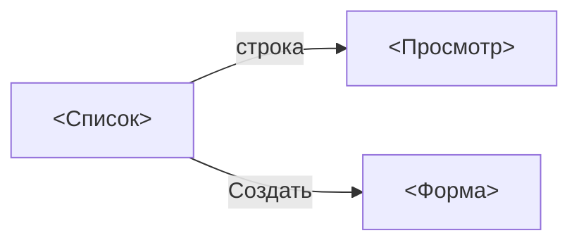

# Design: <название фичи>

<!-- Шаблон этапа 3. Один раздел на экран. -->

## Карта экранов



| Экран | Роут | Закрывает stories | Доступ (роли) |
|-------|------|-------------------|---------------|
| | | | |

## Экран: <название>

### Layout

```
+--------------------------------------------------+
| PageHeader: <заголовок>            [Кнопка]       |
+--------------------------------------------------+
| Фильтры: <поля>                                   |
| DataGrid: <колонки>                               |
+--------------------------------------------------+
```

### Компоненты

| Блок | Компонент | Примечания |
|------|---------------|------------|
| | | |

### Состояния

- **Loading:** <skeleton чего>
- **Empty:** текст «<...>», действие «<...>»
- **Error:** <как показываем, текст, retry>
- **Права:** <что скрыто/disabled для какой роли>

### Формы и валидации

| Поле | Тип | Обязательное | Валидация | Текст ошибки |
|------|-----|--------------|-----------|--------------------|
| | | | | |

### Тексты интерфейса

<!-- Кнопки, заголовки, подтверждения, тосты — финальные формулировки на языке артефактов. -->

## Прототип

<!-- Ссылка на prototype/*.html или "не требуется". -->
