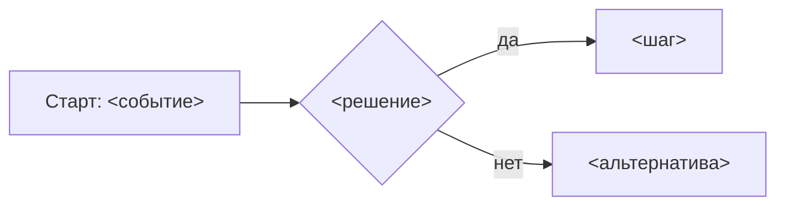

# Spec: <название фичи>

<!-- Шаблон этапа 1. Удали комментарии при заполнении. -->

## Контекст и цель

<!-- 2–4 предложения: какую проблему пользователя решаем, откуда задача
(ссылка на docs/legacy/<модуль>.md, если из legacy). -->

## Роли

<!-- Кто пользуется этой функциональностью и с какими правами. -->

## User Stories

### US-1: <название>

Как **<роль>**, я хочу **<действие>**, чтобы **<ценность>**.

Acceptance criteria:

```gherkin
Сценарий: <название>
  Дано <предусловие>
  Когда <действие>
  Тогда <проверяемый результат>
```

<!-- Несколько сценариев на story — норма: happy path + отказы. -->

## Бизнес-процесс (BPMN)



## Бизнес-правила

| # | Правило | Источник (legacy файл:строка / решение) |
|---|---------|------------------------------------------|
| BR-1 | | |

<!-- Отличия от legacy помечай [ИЗМЕНЕНИЕ vs legacy] с обоснованием. -->

## Полнота операций

<!-- Страховочная сетка на операции, которые не видны из процессов.
Сценарии (US + BPMN выше) покрывают основной ход; здесь — по строке на каждую
сущность фичи, КАЖДАЯ клетка заполнена: либо роль, которой операция доступна,
либо «нет: <почему>». Пустая клетка = дыра спеки, ревьюер вернёт.
В legacy многих таких операций не было — их роль играла правка БД; «в legacy
нет» — это не ответ, решение принимается заново. -->

| Сущность | Создать | Читать | Изменить | Удалить/деактивировать | Отменить/обратить |
|----------|---------|--------|----------|------------------------|-------------------|
| | | | | | |

<!-- «Отменить/обратить» — отмена процесса и обратные операции: снять ошибочную
отметку, вернуть статус. Если операция — отдельный сценарий, ссылка на US. -->

## Нефункциональные требования

<!-- Только реально значимые: объёмы данных, время ответа, аудит, журналирование. -->

## Out of scope

<!-- Явный список того, что НЕ входит в фичу. -->

## Декомпозиция для бэклога

| id | Задача | size | deps |
|----|--------|------|------|
| | | | |

## Открытые вопросы

- [ ] <вопрос человеку>

## Ревью (заполняет requirements-reviewer)

<!-- Замечания: номер, суть, статус (исправлено / требует человека). -->
